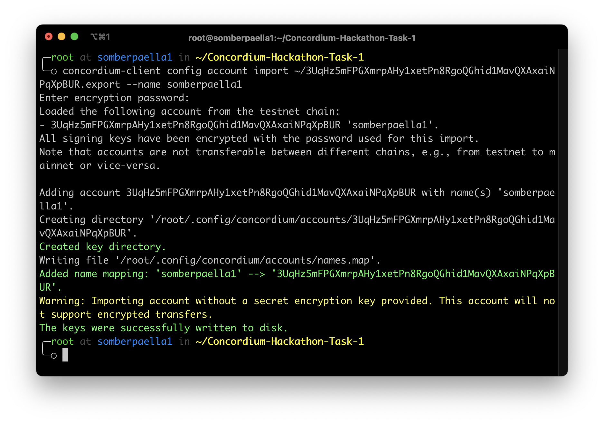
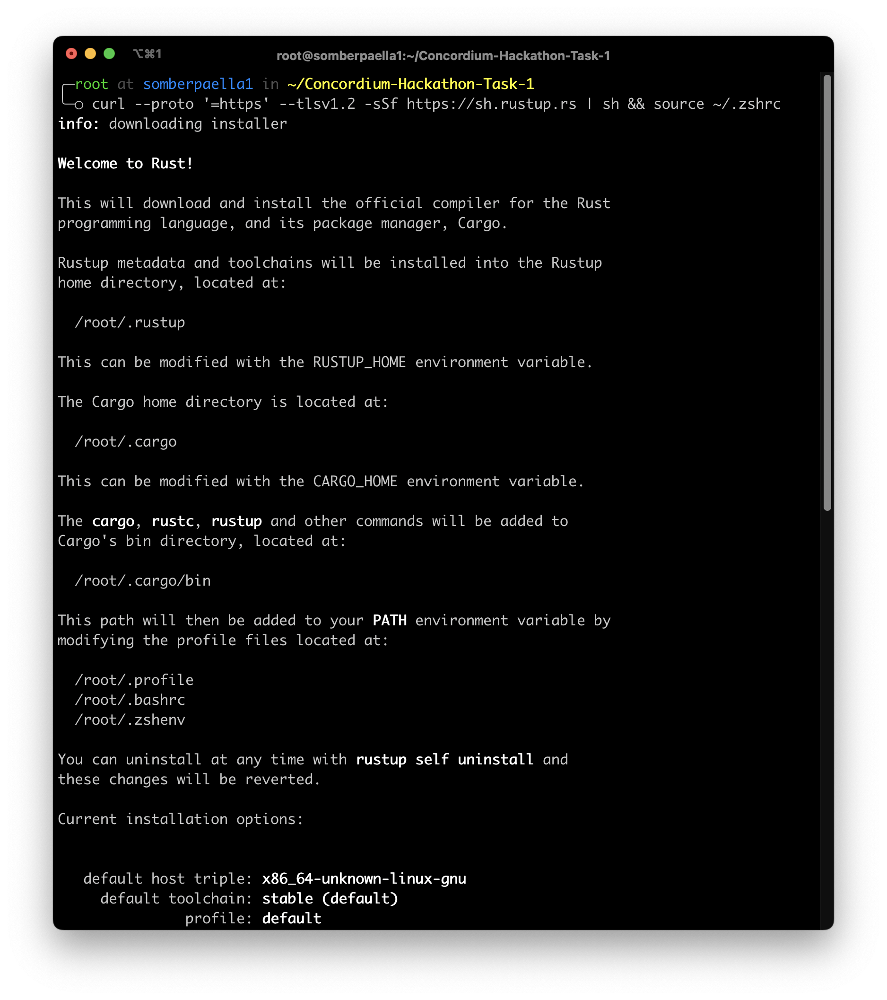
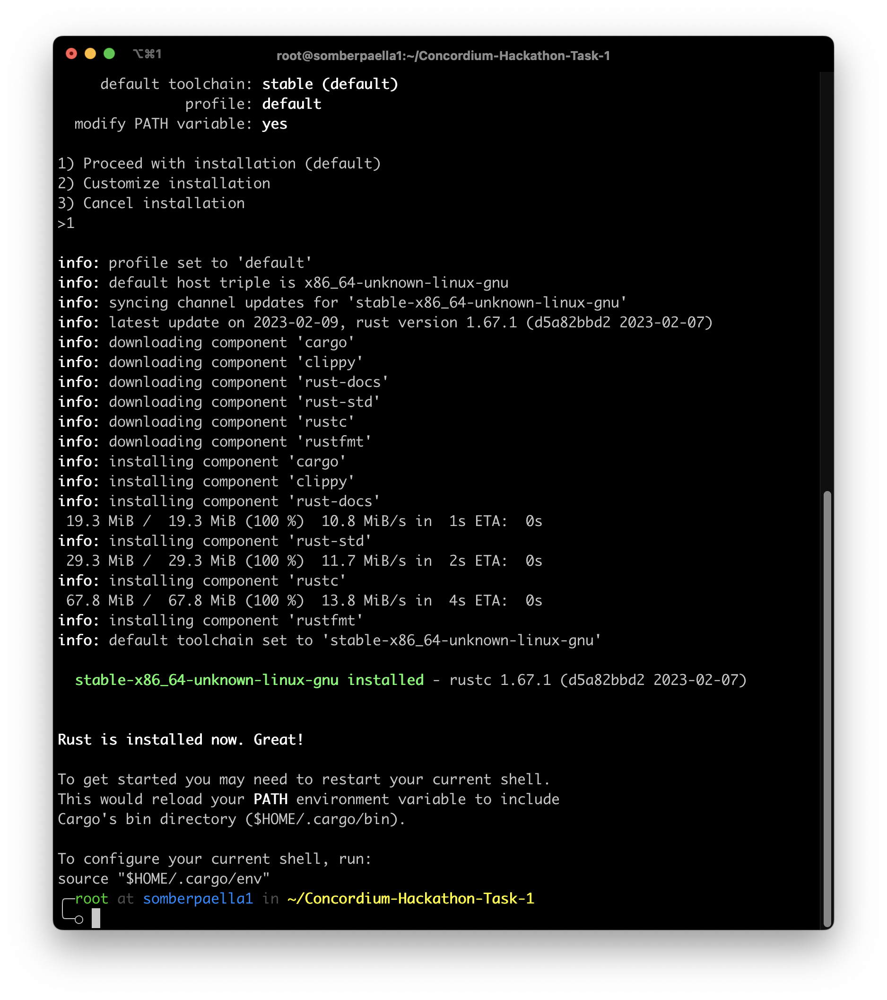
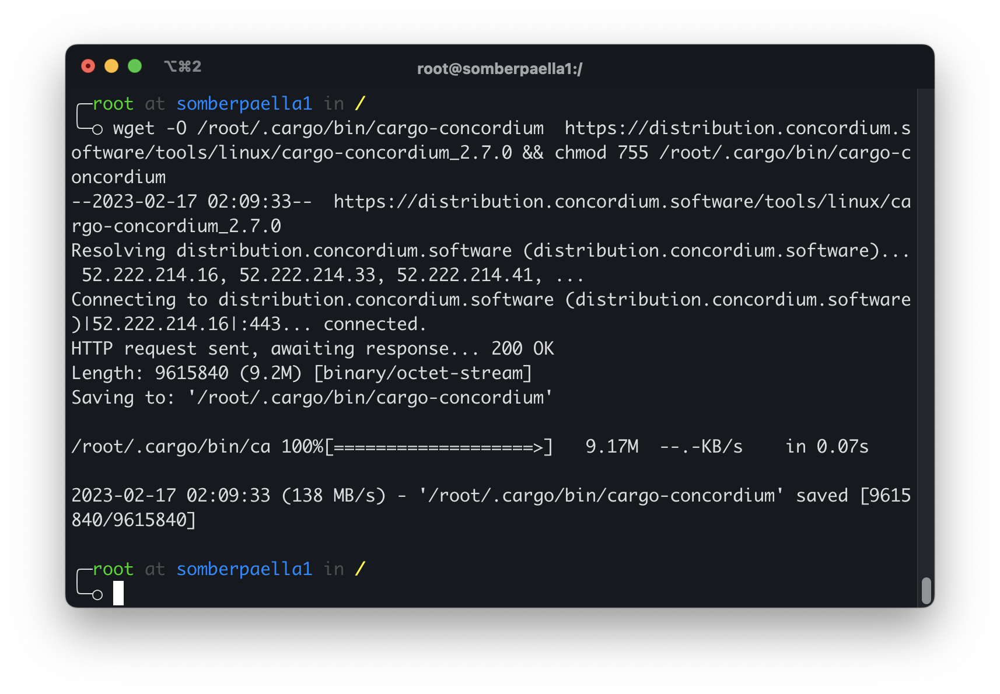
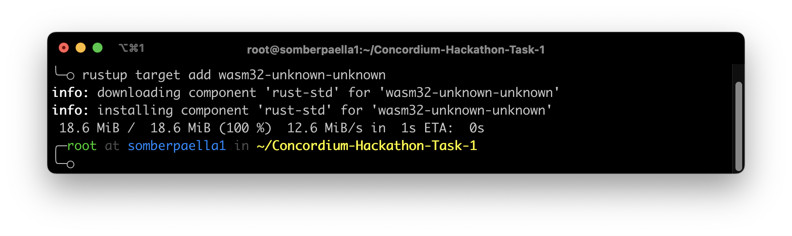
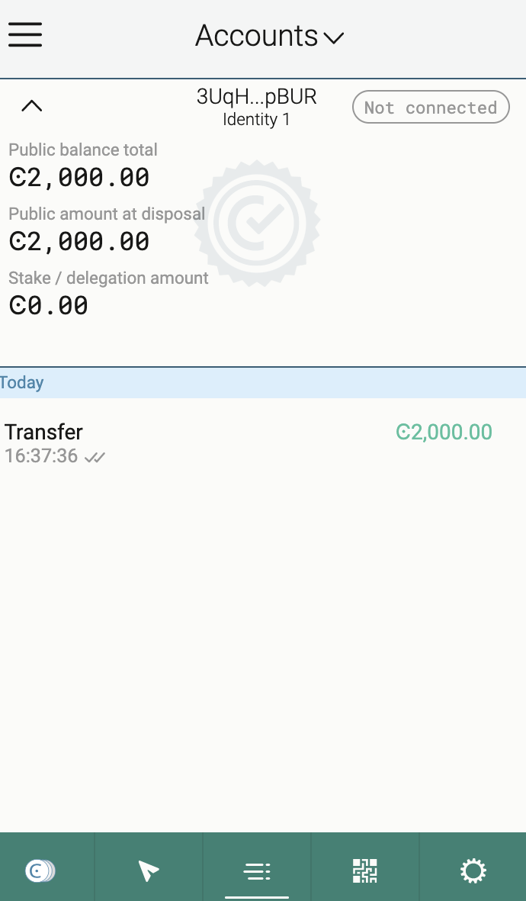

**hack1-concordium**

0. Mainnet
4XQGuZ82xnr7a1ejDBX7UR92egc3CmwmV5jJ2yqtNhGvsnp9BF

1. Install Rust

2. Install cargo-concordium

3. Install Concordium-client

4. Create a Testnet account and acquiring testnet CCD via the CCD faucet

5. Export the account from web wallet and import it into Concordium client

